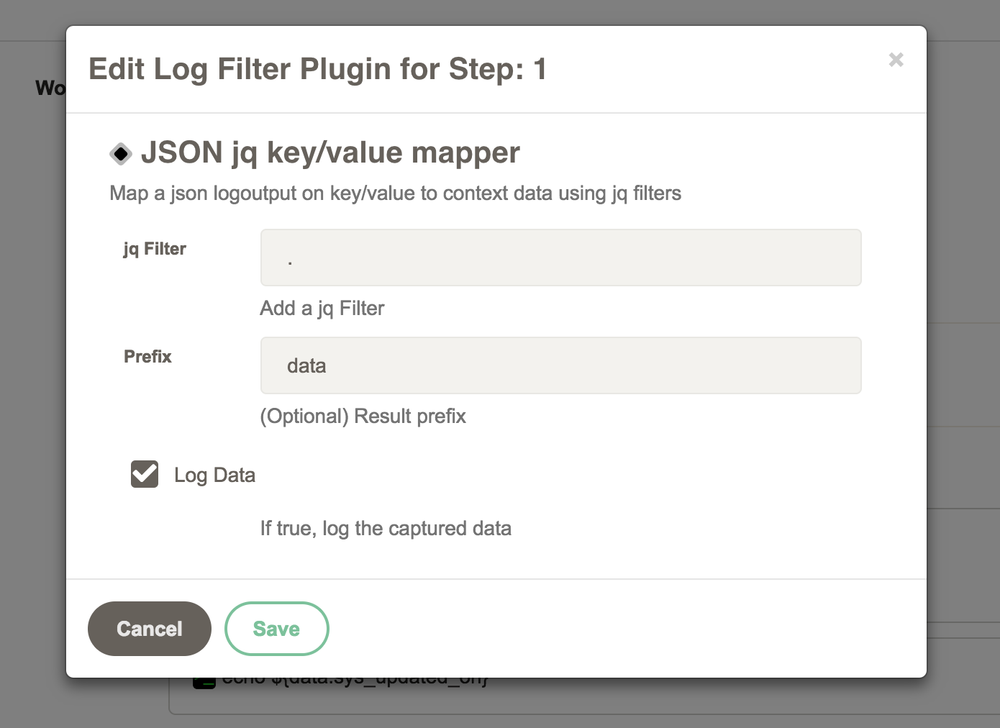
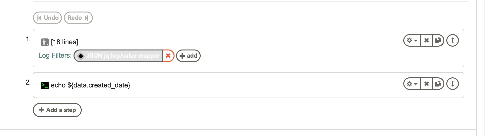
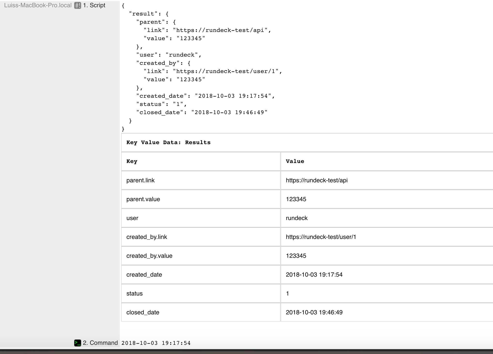

# jq-JSON mapper log filter plugin

This plugin maps a JSON String output from a step to key/value context variables.
It uses the [jackson-jq](https://github.com/eiiches/jackson-jq) java library. 

## Build

```
gradle clean install
```

## Install

```
cp build/lib/jq-json-logfilter-X.X.X.jar $RDECKBASE/libext
```

## How to use

- Add a Log filter to the workflow step what has a json output string



More information about the available jq Filters [here](https://github.com/eiiches/jackson-jq#implementation-status-and-current-limitations)


- Use the context variables on the next steps





